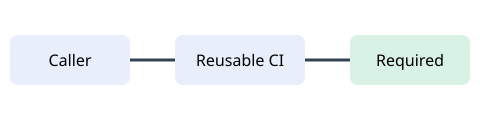

# MiKode CI documentation fixture

This fixture proves that the documentation profile checks Markdown structure, internal
links, heading anchors, and referenced local assets without contacting external sites.

Read the [fixture guide](guides/fixture.md#validated-content) or inspect the architecture
asset below.

